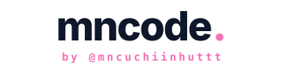

# mncode

<p align="center">
  
</p>

<p align="center">
  <strong>High-Performance Autonomous AI Coding Assistant CLI in Golang</strong><br>
  <em>Next-Generation Pair Programmer with Multi-Account Smart Routing, MCP Support, ClaudeKit Skills & Web Telemetry Hub</em>
</p>

<p align="center">
  <a href="#-quick-install"></a>
  <a href="https://golang.org"></a>
  <a href="https://github.com/mncuchiinhuttt/mncode/releases"></a>
  <a href="https://github.com/mncuchiinhuttt/mncode-web"></a>
  <a href="LICENSE"></a>
</p>

---

## ⚡️ Key Highlights

- 🚀 **Blazing-Fast Golang Core**: Single static binary with sub-20ms cold startup and lightweight RAM footprint. No Node.js runtime, Python virtualenvs, or heavy dependencies needed.
- 🔄 **Multi-Account Smart Routing & Failover**:
  - Connect unlimited **Antigravity (Gemini)**, **Codex (OpenAI)**, **Anthropic Claude**, and **OpenCode / Stealth** accounts simultaneously.
  - Automatic round-robin load balancing and instant cooldown rotation on rate limits (`429`) or quota exhaustion.
  - Auto-import existing credentials directly from `~/.gemini/` and `~/.openai/`.
- 🧠 **Cutting-Edge Reasoning Models & Thinking Budget**:
  - Full support for **`ox-alpha` / `stealth/ox-alpha`** (1,048,576 context tokens reasoning model with 131k output tokens).
  - Extended thinking budgets (`/effort` up to **PRO MAX 64,000 tokens**) for Claude 3.7 Sonnet, Gemini 3.7 Flash Thinking, and o3-mini.
- 🔌 **Model Context Protocol (MCP) Integration**:
  - Full MCP client support with interactive server manager (`/mcp`).
  - Connect stdio & SSE MCP servers with dynamic tool discovery, lazy loading, and eager execution.
- 🌐 **Web Platform & Analytics Hub Sync**:
  - Connect with [`mncode-web`](https://github.com/mncuchiinhuttt/mncode-web) via API Key or CLI login (`/login web`).
  - Automatic daily telemetry synchronization (token consumption, model distribution, request volume).
  - Web dashboard, user role management, and built-in feedback reporting (`/feedback`).
- 🛠️ **Autonomous Multi-Agent Orchestration & Skills**:
  - Discover and execute 60+ modular skills from `.claude/skills/*/SKILL.md`.
  - Specialized built-in subagents: `planner`, `researcher`, `scout`, `tester`, `debugger`, `code-reviewer`, `docs-manager`.
  - 4 Orchestration workflows (`/workflow`): `auto`, `ultra-workflow`, `plan-first`, and `direct`.
- 🎨 **Modern Interactive TUI & Overlays**:
  - Ephemeral status card overlay (`/status`) dismissable with `Esc` without cluttering terminal history.
  - Live fuzzy autocomplete dropdown with argument isolation.
  - Ephemeral side questions (`/btw <question>`) that answer inquiries without polluting main conversation context.
  - Session persistence, history viewer, and interactive resume (`/resume`).
  - Native mouse text selection with smooth copy toast notifications.
  - Gen-Z / Sigma 10x Developer Persona toggle (`/brainrot`).

---

## 🚀 Quick Install

### macOS & Linux (Universal 1-Line Script)

```bash
curl -fsSL https://raw.githubusercontent.com/mncuchiinhuttt/mncode/main/install.sh | bash
```

### Windows (PowerShell)

```powershell
irm https://raw.githubusercontent.com/mncuchiinhuttt/mncode/main/install.ps1 | iex
```

### Build from Source

```bash
git clone https://github.com/mncuchiinhuttt/mncode.git
cd mncode
go build -ldflags="-s -w" -o bin/mncode ./cmd/mncode
```

---

## 🕹️ Interactive Slash Commands

| Command | Description |
| :--- | :--- |
| `/status` | Open interactive session status overlay (`Esc` / `q` to dismiss) |
| `/model [name]` | Interactive model catalog selector (`ox-alpha`, `claude-3.7-sonnet`, `gemini-3.7-flash`, `o3-mini`, etc.) |
| `/effort [level]` | Configure thinking token budget (`None`, `Low`, `Medium`, `High`, `Max`, `PRO MAX`) |
| `/workflow [mode]` | Switch orchestration mode (`auto`, `ultra-workflow`, `plan-first`, `direct`) |
| `/mcp` | Model Context Protocol (MCP) server manager and tool inspector |
| `/skills` | Browse, search, and activate workspace skills catalog |
| `/agents` | Inspect active subagents and multi-agent execution pipeline |
| `/account` | Manage multi-account pool, health checks, and cooldown status |
| `/quota` | Check real-time rate limit headroom and remaining token quotas |
| `/btw <question>` | Ask a side question without consuming conversation context |
| `/theme` | Switch UI color theme (Pastel Pink, Dark, Light, Cyberpunk, Monokai) |
| `/context` | Display context window usage bar and token breakdown |
| `/compact` | Summarize and compress conversation history to free context tokens |
| `/resume` | Browse and resume previous conversation sessions |
| `/feedback <msg>` | Submit direct feedback or bug report to the web admin portal |
| `/brainrot` | Toggle Gen-Z / Sigma 10x developer personality on/off |
| `/clear` | Clear conversation history and reset screen |
| `/help` | Display command palette and keybinding cheat sheet |
| `/exit` | Gracefully exit mncode |

---

## 🔑 Authentication & Providers

### 1. Web Platform Sync (Recommended)

Generate an API key on your [mncode-web](https://github.com/mncuchiinhuttt/mncode-web) dashboard:

```bash
# Login via API key
mncode /login web

# Or login via email/password
mncode /login web --email user@example.com
```

### 2. Multi-Account OAuth Pool

```bash
# Connect Google Antigravity (Gemini)
mncode /login antigravity

# Connect OpenAI Codex
mncode /login codex

# Auto-import local credentials (~/.gemini, ~/.openai)
mncode /account import
```

### 3. Direct API Keys (`.env` or Environment Variables)

```env
# Anthropic
ANTHROPIC_API_KEY=sk-ant-api03-...
ANTHROPIC_MODEL=claude-3-7-sonnet-20250219

# Google Gemini
GEMINI_API_KEY=AIzaSy...
GEMINI_MODEL=gemini-3.7-flash-high

# OpenRouter / OpenCode (ox-alpha)
OPENROUTER_API_KEY=sk-or-v1-...
OPENROUTER_MODEL=stealth/ox-alpha
```

---

## 🏗️ Architecture & Modules

```
mncode/
├── cmd/
│   └── mncode/
│       └── main.go                 # Application entrypoint & CLI flag router
├── pkg/
│   ├── accounts/                   # Multi-account pool, auto-rotation & quota checkers
│   ├── agent/                      # ReAct agent loop, prompt builder & subagent coordinator
│   ├── config/                     # Configuration loader, .env & persistent settings store
│   ├── mcp/                        # Model Context Protocol client & server lifecycle manager
│   ├── provider/                   # LLM backends (Anthropic, Gemini, OpenAI, OpenRouter, OpenCode)
│   ├── skills/                     # Open Agent Skills parser (.claude/skills, rules, agents)
│   ├── stats/                      # Token usage tracking, telemetry sync & visualizer
│   ├── tools/                      # Tool suite (Bash, File Slice, Ripgrep, Subagents, Web)
│   └── ui/                         # Interactive terminal REPL, theme selector & overlays
├── dist/                           # Multi-platform compiled release binaries
├── install.sh                      # Universal macOS/Linux 1-line curl installer
├── install.ps1                     # Universal Windows PowerShell 1-line installer
└── LICENSE                         # MIT License
```

---

## 🌐 Ecosystem

- **CLI Engine**: [mncode](https://github.com/mncuchiinhuttt/mncode) — High-performance Golang CLI.
- **Web Platform**: [mncode-web](https://github.com/mncuchiinhuttt/mncode-web) — Web UI, Docs, Auth & Analytics Hub.

---

## 📄 License

Distributed under the [MIT License](LICENSE). Built with ❤️ by [mncuchiinhuttt](https://github.com/mncuchiinhuttt).
